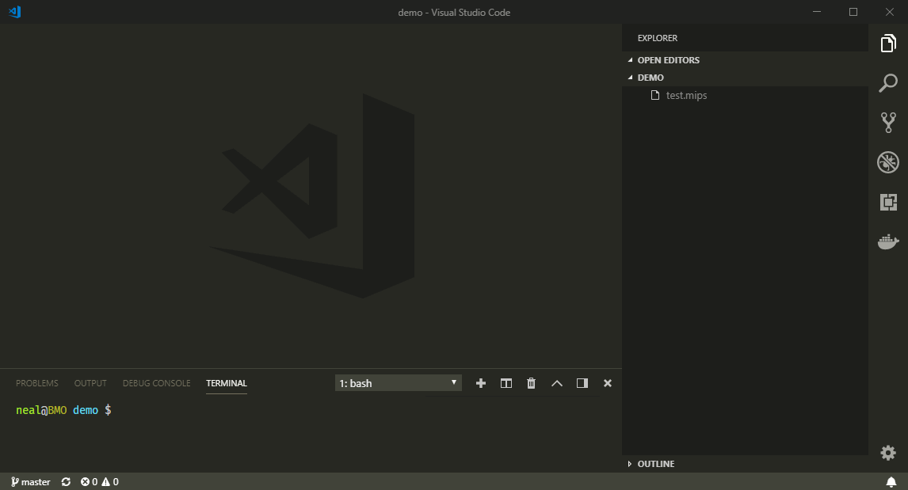

# dashmips-debugger

This is a debugger adapter for the dashmips python package.



## Features

It runs and communicates with the dashmips debug server.

## Requirements

Dashmips

```sh
pip install dashmips
```

## Extension Settings

None yet.

## Known Issues

Very much a work in progress.

## Release Notes

### 0.0.11

Version jump to sync with [dashmips python extension](https://pypi.org/project/dashmips/).

### 0.0.2

Add icon

### 0.0.1

First ever release.
